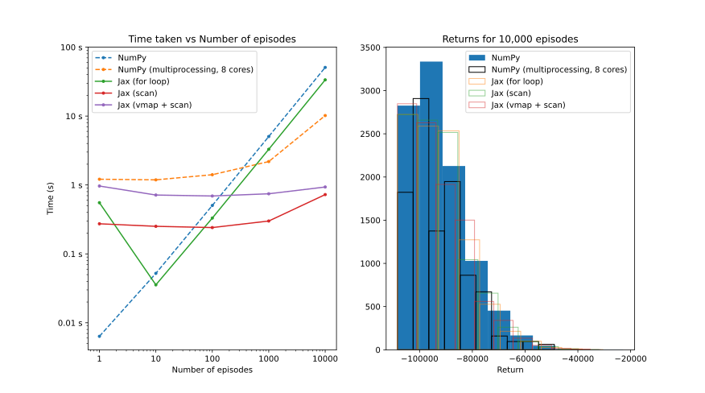

# jax-imprl 🚀
A JAX accelerated version of IMPRL (Inspection and Maintenance Planning with Reinforcement Learning), a library for applying reinforcement learning to inspection and maintenance planning of deteriorating engineering systems.

## Installation 📦

### 1. Install uv

<details>
<summary>Why install uv?</summary>
An extremely fast Python package and project manager, written in Rust. It is much faster than pip and pip-tools, and has a simple CLI for managing dependencies, virtual environments, and scripts. More info here: https://docs.astral.sh/uv/
</details>

You can install uv using the following methods ([see docs for OS-specific options](https://docs.astral.sh/uv/getting-started/installation/)):

```bash
# macOS (Homebrew)
brew install uv

# Or via script (Linux/macOS)
curl -LsSf https://astral.sh/uv/install.sh | sh
```

### 2. Create a virtual environment

(Recommended) Create a uv-managed virtualenv:
```bash
uv venv --python 3.9 # create virtual environment
source .venv/bin/activate  # activate virtual environment
```

<details>
<summary>Alternative: conda</summary>

```bash
conda create --name jax_imprl_env -y python==3.9
conda activate jax_imprl_env
```

</details>

### 3. Install the dependencies (uv)

```bash
# CPU (default): install base dependencies, creating uv.lock
uv sync

# GPU (optional): add the GPU group to enable CUDA-backed JAX
uv sync --group gpu

# Dev tools (optional): formatter, tests, etc.
uv sync --group dev
```

<details>
<summary>GPU notes</summary>

- The `gpu` group installs `jax[cuda12_pip]` (CUDA 12 via pip packages) on Linux with NVIDIA GPUs.
- If you maintain your own local CUDA 12 install, you can switch to `jax[cuda12_local]` by editing the `gpu` group in `pyproject.toml`.
- macOS uses the CPU build of JAX by default.

</details>

<details>
<summary>Installing additional packages</summary>

Add packages with `uv add` and optionally assign them to an extra or group.

For example, to add [pandas](https://pypi.org/project/pandas/) allowing any 2.x release:

```bash
uv add "pandas>=2,<3"
```

To add a dev-only tool:

```bash
uv add --group dev ruff
```

If resolution fails, relax version ranges and retry.
</details>

### 4. (optional) Test the installation
You can run unit tests to verify that the installation was successful.

```bash
uv sync --group dev # ensure dev dependencies are installed
pytest -v tests
```

### 5. (optional) Setup wandb

For logging, the library relies on [wandb](https://wandb.ai). You can log into wandb using your private API key, 

```bash
wandb login
# <enter wandb API key>
```

## JAX vs NumPy Performance Comparison ⚡

### Environment Rollouts

We compare the performance of JAX with NumPy (multiprocessing) for simulating rollouts for a $k$-out-of-$n$ system with 5 components (agents), where each episode consists of 50 time steps. For 10,000 episodes, JAX (solid lines) achieves up to **~14x** speedup over NumPy (dashed lines).



| # Episodes | NumPy (for loop) [s] | NumPy (mp) [s] | JAX (scan) [s] | Speedup: NumPy (mp) vs. JAX (scan) |
|:-----------:|---------------------:|---------------:|-------------------:|---------------:|
| 1           | 0.01 | 1.18 | 0.27 | 4.39× |
| 10          | 0.05 | 1.2 | 0.24 | 5.01× |
| 100         | 0.51 | 1.3 | 0.24 | 5.41× |
| 1,000       | 5.09 | 2.09| 0.28 | 7.4× |
| 10,000      | 51.94 | 10.02  | 0.72 | **13.88×** |

### RL Training

We further benchmark RL training on variants of the $k$-out-of-$n$ system. JAX achieves over **5x - 12x faster** training throughput than the equivalent PyTorch implementation running on 8 CPU cores.
| Environment | Agents | Episodes | Timesteps | MBP (JAX) [s] | MBP (PyTorch 8 CPUs) [s] | Speedup |
|:-------------|:-------:|:----------:|:-----------:|---------------:|--------------------------:|:--------:|
| `k_n_infinite` | 4 | 50,000 | 2.5 M | 403.9 s (0:06:44) | 4883.6 s (1:21:24) | **12×** |
| `k_n_50` | 5 | 100,000 | 5 M | 1781 s (0:29:41) | 9571.8 s (2:39:32) | **5.4×** |

Hardware specs: Apple M1 Pro, 16GB RAM

## Docker 🐳

If you want to run the code in a containerized environment, you can use the following Docker image and the previous installation steps.

```bash
docker pull nvidia/cuda
```

In case you don't have accesss to NVIDIA GPUs, you can rent a cloud instance and load the above Docker image. For example, [vast.ai](https://vast.ai) at ~$0.30/hour ([pricing](https://vast.ai/#pricing))

```bash
https://cloud.vast.ai/?ref_id=113803&creator_id=113803&name=JAX%2BRL
```

## Related Work 🔗

- [IMPRL](https://github.com/omniscientoctopus/imprl): small-scale k-out-of-n environments with upto 5 components.

- [IMP-MARL](https://github.com/moratodpg/imp_marl): a platform for benchmarking the scalability of cooperative MARL methods in real-world engineering applications.

    - Environments: (Correlated and uncorrelated) k-out-of-n systems and offshore wind structural systems.
    - RL solvers: Provides wrappers for interfacing with several (MA)RL libraries such as [EPyMARL](https://github.com/uoe-agents/epymarl), [RLlib](imp_marl/imp_wrappers/examples/rllib/rllib_example.py), [MARLlib](imp_marl/imp_wrappers/marllib/marllib_wrap_ma_struct.py) etc.

## Acknowledgements 🙏

This repository is inspired by the following projects:

[PureJAXRL](https://github.com/luchris429/purejaxrl) by [luchris429](https://github.com/luchris429)

[CleanRL](https://github.com/vwxyzjn/cleanrl) started by [vwxyzjn](https://github.com/vwxyzjn)
