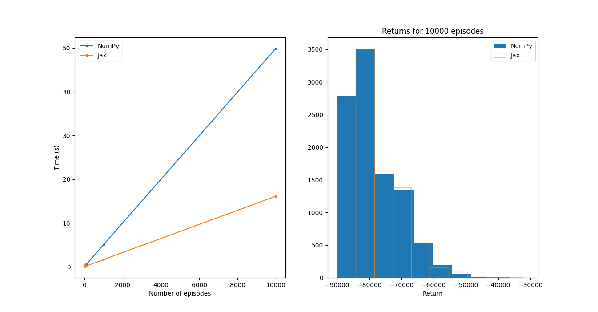

# JAX vs NumPy

```python
experiments = [1, 10, 100, 1_000, 10_000]
```

```bash
>> python jax_vs_numpy.py
NumPy timings: [0.01, 0.05, 0.52, 5.15, 52.16]
Jax timings: [0.4, 0.02, 0.16, 1.6, 15.89]
Speedup: [0.01, 3.31, 3.17, 3.22, 3.28]
```

Speedups and distribution of returns over 10k episodes:

