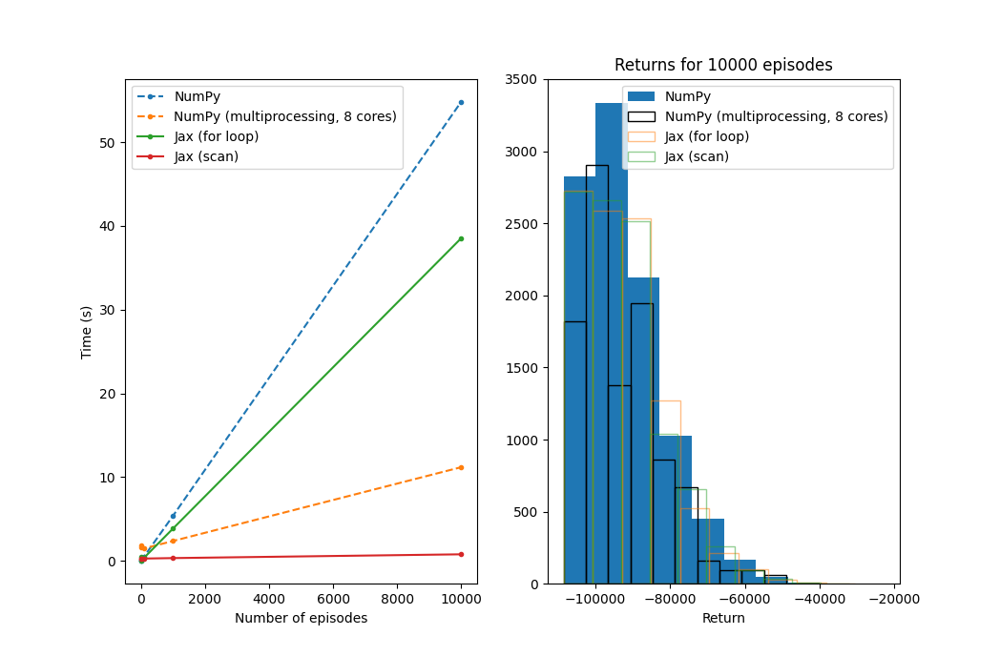

# JAX vs NumPy

```python
experiments = [1, 10, 100, 1_000, 10_000] # episodes
```

```bash
>> python jax_vs_numpy.py
Time taken for each experiment (in seconds):
NumPy (for loop): [0.01, 0.05, 0.54, 5.39, 54.84]
NumPy (multiprocessing): [1.84, 1.63, 1.49, 2.38, 11.19]
Jax (for loop): [0.52, 0.04, 0.39, 3.87, 38.54]
Jax (scan): [0.28, 0.28, 0.28, 0.34, 0.79]

Speedups wrt NumPy (for loop):
Speedup (Jax): [0.01, 1.33, 1.39, 1.39, 1.42]
Speedup (Jax scan): [0.02, 0.19, 1.9, 15.86, 69.36]

Speedups wrt NumPy (multiprocessing):
Speedup (Jax): [3.51, 41.01, 3.82, 0.62, 0.29]
Speedup (Jax scan): [6.5, 5.81, 5.24, 7.01, 14.16]

Mean returns: [-92739.74, -92771.94, -92533.83, -92670.86]
Relative error mean returns wrt NumPy: [-0.03, -0.22, -0.07]
```

Hardware specs: Apple M1 Pro, 16GB RAM

Speedups and distribution of returns over 10k episodes:

